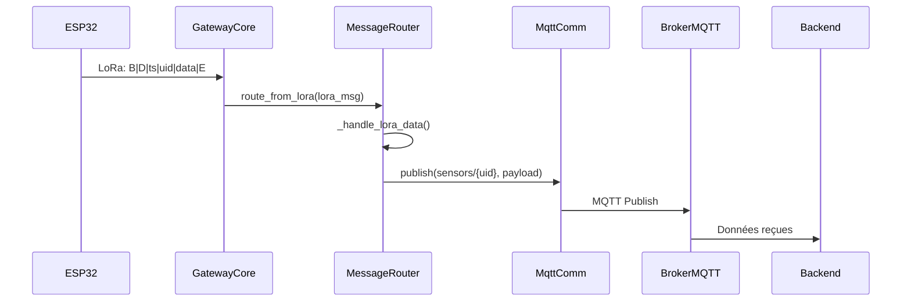
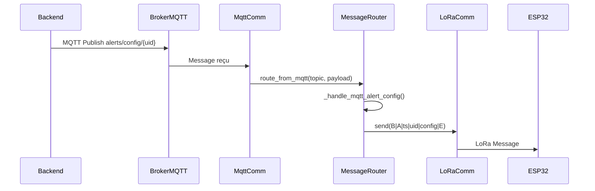
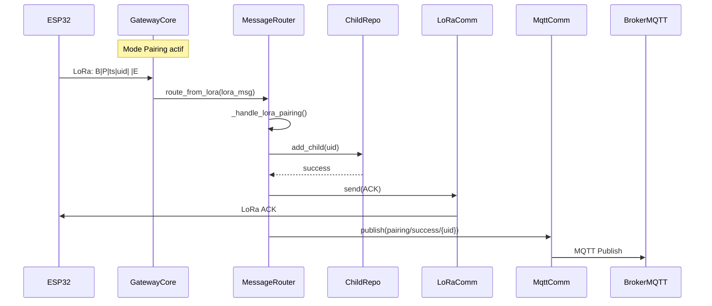

# Architecture du Système Gateway Pi5

## Table des Matières
- [Vue d'Ensemble](#vue-densemble)
- [GatewayCore - Cœur du Système](#gatewaycore---cœur-du-système)
- [MessageRouter - Routing Intelligent](#messagerouter---routing-intelligent)
- [Flux de Données Général](#flux-de-données-général)
- [Communication entre Composants](#communication-entre-composants)
- [Diagrammes](#diagrammes)

## Vue d'Ensemble

Le système Gateway Pi5 est conçu selon une architecture modulaire qui sépare clairement les responsabilités :

```
┌───────────────────────────────────────────────────────┐
│                GatewayCore (Cœur)                     │
└───────────────────────────────────────────────────────┘
                        │
                        ▼
┌───────────────────────────────────────────────────────┐
│                MessageRouter (Routing)                │
└───────────────────────────────────────────────────────┘
                        │
    ┌───────────────────┴───────────────────┐
    │                                   │
    ▼                                   ▼
┌─────────────┐                     ┌─────────────┐
│ LoRaComm     │                     │ MqttComm    │
└─────────────┘                     └─────────────┘
    │                                   │
    ▼                                   ▼
┌─────────────┐                     ┌─────────────┐
│ ChildRepo    │                     │ Backend     │
└─────────────┘                     └─────────────┘
```

## GatewayCore - Cœur du Système

### Rôle Principal
Le `GatewayCore` est la classe principale qui :
- **Coordonne** tous les composants
- **Gère** le cycle de vie du système
- **Contrôle** les états du système
- **Supervise** la communication entre composants

### Structure Interne

```python
class GatewayCore:
    # Composants
    ├── lora_comm: LoRaCommunication      # Gestion radio LoRa
    ├── mqtt_comm: MqttCommunication      # Gestion MQTT
    ├── child_repo: ChildRepository       # Persistence enfants
    └── message_router: MessageRouter     # Routing des messages
    
    # États
    ├── current_state: State              # État courant
    └── states: Dict[SystemState, State]  # Tous les états possibles
    
    # Données
    ├── config: Dict                      # Configuration
    └── stats: Dict                       # Statistiques
```

### Cycle de Vie

#### 1. Initialisation
```python
def __init__(self, config: Dict[str, Any]):
    # Initialise la configuration et les états
    self.config = config
    self.states = {
        SystemState.NORMAL: NormalState(self),
        SystemState.PAIRING: PairingState(self),
        SystemState.MAINTENANCE: MaintenanceState(self)
    }
```

#### 2. Initialisation des Composants
```python
def initialize_components(self, lora_comm, mqtt_comm, child_repo, message_router):
    # Reçoit les instances des composants
    self.lora_comm = lora_comm
    self.mqtt_comm = mqtt_comm
    self.child_repo = child_repo
    self.message_router = message_router
    
    # Initialise chaque composant
    self.lora_comm.initialize()
    self.mqtt_comm.initialize()
    self.child_repo.initialize()
```

#### 3. Boucle Principale
```python
def main_loop(self):
    while self.running:
        # 1. Gère l'état courant
        self.current_state.handle()
        
        # 2. Traite les messages LoRa
        self.process_lora_messages()
        
        # 3. Vérifie la connexion MQTT
        self.process_mqtt_messages()
        
        # 4. Met à jour les stats
        self.stats["uptime"] = time.time() - self.stats["uptime"]
        
        time.sleep(0.01)  # Évite la saturation CPU
```

### Méthodes Clés

#### Traitement des Messages LoRa
```python
def process_lora_messages(self):
    # 1. Reçoit un message LoRa
    message = self.lora_comm.receive()
    
    # 2. Parse en LoRaMessage
    lora_msg = LoRaMessage.from_lora_format(message)
    
    # 3. Route vers le MessageRouter
    self.message_router.route_from_lora(lora_msg)
```

#### Gestion des États
```python
def set_state(self, state: SystemState):
    # 1. Sort de l'état courant
    if self.current_state:
        self.current_state.exit()
    
    # 2. Entre dans le nouvel état
    self.current_state = self.states[state]
    self.current_state.enter()

def trigger_pairing_mode(self):
    # Active le mode pairing
    self.set_state(SystemState.PAIRING)
```

#### Gestion du Bouton Physique
```python
def handle_button_press(self, duration: float):
    if duration >= 15:
        # Appui long: Reset complet
        self.child_repo.remove_all_children()
    elif duration >= 3:
        # Appui court: Active pairing
        self.trigger_pairing_mode()
```

## MessageRouter - Routing Intelligent

### Rôle Principal
Le `MessageRouter` est responsable de :
- **Router** les messages entre LoRa et MQTT
- **Transformer** les formats de données
- **Appliquer** la logique métier
- **Déléguer** aux composants appropriés

### Architecture des Handlers

```
┌───────────────────────────────────────────────────────┐
│                    MessageRouter                     │
└───────────────────────────────────────────────────────┘
                        │
                        ▼
┌───────────────────────────────────────────────────────┐
│              Routing Dynamique (route_from_lora)      │
│  ┌─────────────────────────────────────────────────┐  │
│  │ 1. Détermine le type de message                │  │
│  │ 2. Trouve le handler approprié                 │  │
│  │ 3. Appelle le handler                          │  │
│  └─────────────────────────────────────────────────┘  │
└───────────────────────────────────────────────────────┘
                        │
    ┌───────────────────┴───────────────────┐
    │                                   │
    ▼                                   ▼
┌─────────────┐                     ┌─────────────┐
│ _handle_lora_data  │                     │ _handle_lora_pairing │
└─────────────┘                     └─────────────┘
┌─────────────┐                     ┌─────────────┐
│ _handle_lora_alert │                     │ _handle_mqtt_config │
└─────────────┘                     └─────────────┘
```

### Routing Dynamique

#### Pour les messages LoRa
```python
def route_from_lora(self, lora_message: LoRaMessage):
    # 1. Construit le nom du handler
    handler_name = f"_handle_lora_{lora_message.message_type.name.lower()}"
    # Ex: "_handle_lora_data", "_handle_lora_pairing"
    
    # 2. Récupère la méthode (ou le fallback)
    handler = getattr(self, handler_name, self._handle_unknown_lora)
    
    # 3. Appelle le handler
    handler(lora_message)
```

#### Pour les messages MQTT
```python
def route_from_mqtt(self, topic: str, payload: str, qos: int = 1):
    # 1. Parse le message MQTT
    mqtt_message = MqttMessage.from_mqtt(topic, payload, qos)
    
    # 2. Extrait l'UID du topic
    uid = self._extract_uid_from_topic(topic)
    
    # 3. Route selon le topic
    if "alerts/config" in topic:
        self._handle_mqtt_alert_config(uid, mqtt_message.payload)
    elif "pairing/unpair" in topic:
        self._handle_mqtt_unpair(uid, mqtt_message.payload)
```

### Handlers Principaux

#### 1. Traitement des Données Capteurs (LoRa → MQTT)
```python
def _handle_lora_data(self, message: LoRaMessage):
    # 1. Parse les données capteurs
    sensor_data = SensorData.from_lora_data(message.data)
    
    # 2. Vérifie l'autorisation
    if not self.gateway.child_repo.is_child_authorized(message.uid):
        return
    
    # 3. Construit le payload MQTT
    payload = {
        "uid": message.uid,
        "timestamp": message.timestamp,
        "sensors": sensor_data.to_dict()
    }
    
    # 4. Publie sur MQTT
    topic = f"garden/sensors/{message.uid}"
    self.gateway.mqtt_comm.publish(topic, payload, qos=1)
```

#### 2. Traitement du Pairing (LoRa → MQTT)
```python
def _handle_lora_pairing(self, message: LoRaMessage):
    # 1. Vérifie le mode pairing
    if not isinstance(self.gateway.current_state, PairingState):
        return
    
    # 2. Ajoute l'enfant
    success = self.gateway.child_repo.add_child(message.uid)
    
    # 3. Envoie ACK LoRa
    ack_message = LoRaMessage(
        message_type=MessageType.ACK,
        timestamp=message.timestamp,
        uid=self.gateway.child_repo.get_parent_id(),
        data=message.uid
    )
    self.gateway.lora_comm.send(ack_message.to_lora_format())
    
    # 4. Notifie via MQTT
    self.gateway.mqtt_comm.publish(
        f"garden/pairing/success/{message.uid}",
        {"uid": message.uid, "parent_id": parent_id},
        qos=0
    )
```

#### 3. Traitement des Configurations d'Alerte (MQTT → LoRa)
```python
def _handle_mqtt_alert_config(self, uid: str, payload: Dict[str, Any]):
    # 1. Vérifie l'enfant
    if not self.gateway.child_repo.is_child_authorized(uid):
        return
    
    # 2. Crée la configuration
    alert_config = AlertConfig.from_mqtt_payload(uid, payload)
    
    # 3. Construit le message LoRa
    lora_message = LoRaMessage(
        message_type=MessageType.ALERT_CONFIG,
        timestamp=self._get_current_timestamp(),
        uid=uid,
        data=alert_config.to_lora_data()
    )
    
    # 4. Envoie via LoRa
    self.gateway.lora_comm.send(lora_message.to_lora_format())
```

## Flux de Données Général

### 1. Données Capteurs (ESP32 → Pi5 → Backend)

```
┌─────────┐      LoRa      ┌───────────────────────────────────────┐
│ ESP32   │ ─────────────▶ │               GatewayCore             │
└─────────┘                └───────────────────────────────────────┘
                                      │
                                      ▼
┌───────────────────────────────────────────────────────┐
│                    MessageRouter                      │
│  ┌─────────────────────────────────────────────────┐  │
│  │ _handle_lora_data()                            │  │
│  │ 1. Parse les données capteurs                   │  │
│  │ 2. Vérifie l'autorisation                       │  │
│  │ 3. Construit payload MQTT                       │  │
│  └─────────────────────────────────────────────────┘  │
└───────────────────────────────────────────────────────┘
                                      │
                                      ▼
┌───────────────────────────────────────────────────────┐
│                    MqttCommunication                  │
│  Publie sur: garden/sensors/{uid}                   │
└───────────────────────────────────────────────────────┘
                                      │
                                      ▼
┌───────────────────────────────────────────────────────┐
│                    Broker MQTT                        │
└───────────────────────────────────────────────────────┘
                                      │
                                      ▼
┌───────────────────────────────────────────────────────┐
│                    Backend                            │
└───────────────────────────────────────────────────────┘
```

### 2. Configuration d'Alerte (Backend → Pi5 → ESP32)

```
┌─────────────┐      MQTT      ┌───────────────────────────────────────┐
│ Backend     │ ─────────────▶ │               GatewayCore             │
└─────────────┘                └───────────────────────────────────────┘
                                      │
                                      ▼
┌───────────────────────────────────────────────────────┐
│                    MqttCommunication                  │
│  Reçoit sur: garden/alerts/config/{uid}              │
└───────────────────────────────────────────────────────┘
                                      │
                                      ▼
┌───────────────────────────────────────────────────────┐
│                    MessageRouter                      │
│  ┌─────────────────────────────────────────────────┐  │
│  │ _handle_mqtt_alert_config()                     │  │
│  │ 1. Vérifie l'enfant                             │  │
│  │ 2. Parse la configuration                       │  │
│  │ 3. Construit message LoRa                       │  │
│  └─────────────────────────────────────────────────┘  │
└───────────────────────────────────────────────────────┘
                                      │
                                      ▼
┌───────────────────────────────────────────────────────┐
│                    LoRaCommunication                  │
│  Envoie: B|A|timestamp|uid|config_data|E              │
└───────────────────────────────────────────────────────┘
                                      │
                                      ▼
┌─────────────┐      LoRa      ┌───────────────────────────────────────┐
│ ESP32       │ ◀───────────── │               GatewayCore             │
└─────────────┘                └───────────────────────────────────────┘
```

### 3. Appariement (ESP32 → Pi5 → Backend)

```
┌─────────┐      LoRa      ┌───────────────────────────────────────┐
│ ESP32   │ ─────────────▶ │               GatewayCore             │
└─────────┘  (en mode pairing) └───────────────────────────────────────┘
                                      │
                                      ▼
┌───────────────────────────────────────────────────────┐
│                    MessageRouter                      │
│  ┌─────────────────────────────────────────────────┐  │
│  │ _handle_lora_pairing()                          │  │
│  │ 1. Vérifie mode pairing                         │  │
│  │ 2. Ajoute l'enfant                              │  │
│  │ 3. Envoie ACK LoRa                              │  │
│  └─────────────────────────────────────────────────┘  │
└───────────────────────────────────────────────────────┘
                                      │
                                      ▼
┌───────────────────────────────────────────────────────┐
│                    MqttCommunication                  │
│  Publie sur: garden/pairing/success/{uid}           │
└───────────────────────────────────────────────────────┘
                                      │
                                      ▼
┌───────────────────────────────────────────────────────┐
│                    Broker MQTT                        │
└───────────────────────────────────────────────────────┘
                                      │
                                      ▼
┌───────────────────────────────────────────────────────┐
│                    Backend                            │
│  Met à jour la base de données des devices           │
└───────────────────────────────────────────────────────┘
```

## Communication entre Composants

### 1. GatewayCore → MessageRouter

**Direction:** LoRa → MQTT
```python
# Dans GatewayCore.process_lora_messages()
lora_msg = LoRaMessage.from_lora_format(raw_message)
self.message_router.route_from_lora(lora_msg)
```

**Direction:** MQTT → LoRa
```python
# Callback MQTT dans MqttCommunication
self.message_router.route_from_mqtt(topic, payload, qos)
```

### 2. MessageRouter → Composants

**Vers LoRaCommunication:**
```python
# Dans les handlers LoRa→MQTT
self.gateway.lora_comm.send(message.to_lora_format())
```

**Vers MqttCommunication:**
```python
# Dans les handlers MQTT→LoRa
self.gateway.mqtt_comm.publish(topic, payload, qos)
```

**Vers ChildRepository:**
```python
# Pour vérification/gestion des enfants
self.gateway.child_repo.is_child_authorized(uid)
self.gateway.child_repo.add_child(uid)
self.gateway.child_repo.remove_child(uid)
```

### 3. GatewayCore → Composants

**Contrôle des états:**
```python
# Changement d'état
self.set_state(SystemState.PAIRING)
# Le state manager appelle les méthodes enter()/exit()
```

**Gestion du bouton:**
```python
# Appel depuis le thread de monitoring du bouton
self.gateway.handle_button_press(duration)
```

## Diagrammes

### Diagramme de Séquence - Données Capteurs



### Diagramme de Séquence - Configuration Alerte



### Diagramme de Séquence - Appariement



## Résumé des Interactions

| Composant          | Rôle Principal                          | Interactions avec...          |
|--------------------|-----------------------------------------|-------------------------------|
| **GatewayCore**     | Orchestration générale                  | Tous les composants           |
| **MessageRouter**  | Routing et transformation des messages  | GatewayCore, LoRaComm, MqttComm|
| **LoRaCommunication** | Gestion de la radio LoRa              | GatewayCore, MessageRouter    |
| **MqttCommunication** | Gestion de la connexion MQTT         | GatewayCore, MessageRouter    |
| **ChildRepository** | Persistence des enfants appairés       | GatewayCore, MessageRouter    |

## Bonnes Pratiques

1. **Séparation des Responsabilités** : Chaque composant a un rôle bien défini
2. **Communication par Interfaces** : Les composants communiquent via des méthodes bien définies
3. **Gestion d'État Explicite** : Le système utilise le pattern State pour gérer ses modes
4. **Routing Dynamique** : Le MessageRouter utilise la réflexion pour trouver les handlers
5. **Tolérance aux Pannes** : Gestion des erreurs et reconnexion automatique

## Extensibilité

Pour ajouter un nouveau type de message :
1. Ajouter une valeur à l'énumération `MessageType`
2. Implémenter un handler `_handle_lora_nouveau_type()` dans MessageRouter
3. Si nécessaire, ajouter un handler MQTT correspondant
4. Le système routera automatiquement vers le nouveau handler

Cette architecture permet une évolution facile du système sans modifier le code existant.