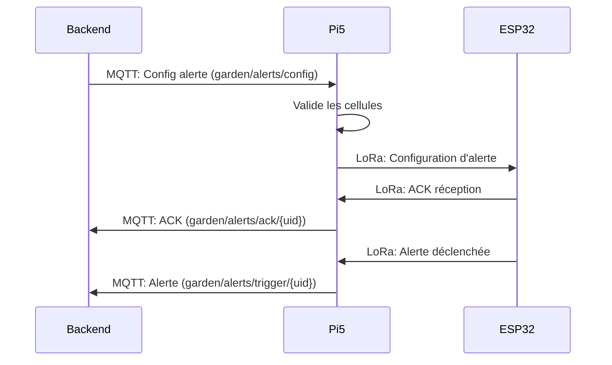

# Formats de Données - Intégration avec le Backend

## Table des Matières
- [Modèles de Données](#modèles-de-données)
- [SensorData - Données Capteurs](#sensordata---données-capteurs)
- [AlertConfig - Configuration d'Alerte](#alertconfig---configuration-dalerte)
- [AlertTrigger - Alerte Déclenchée](#alerttrigger---alerte-déclenchée)
- [Correspondance avec le Backend](#correspondance-avec-le-backend)
- [Exemples de Payloads MQTT](#exemples-de-payloads-mqtt)
- [Formats LoRa](#formats-lora)

## Modèles de Données

Les modèles ont été adaptés pour correspondre exactement aux structures du backend et conserver les codes originaux des capteurs.

## SensorData - Données Capteurs

### Structure
```python
@dataclass
class SensorData:
    raw_data: str          # Format original: "1TA25;1HA60;1TS23..."
    parsed_values: Dict[str, float]  # {code: valeur}
```

### Caractéristiques
- **Conserve le format original** : Le backend reçoit les données brutes au format `1TA25;1HA60;...`
- **Parsing supplémentaire** : Les valeurs sont aussi disponibles sous forme parsée dans `parsed_values`
- **Codes conservés** : Utilise les codes originaux (TA, HA, TS, etc.) sans conversion

### Exemple
**Donnée LoRa entrée (format avec index et :):** `"1TA:25;1HA:60;1TS:23;1L:1000;1B:85"`

**SensorData créé:**
```python
SensorData(
    raw_data="1TA:25;1HA:60;1TS:23;1L:1000;1B:85",
    parsed_values={
        "TA:1": 25.0,    # Température air (index 1)
        "HA:1": 60.0,    # Humidité air (index 1)
        "TS:1": 23.0,    # Température sol (index 1)
        "L:1": 1000.0,   # Lumière (index 1)
        "B:1": 85.0      # Batterie (index 1)
    }
)
```

**Payload MQTT généré:**
```json
{
    "uid": "ESP32_001",
    "timestamp": "2023-01-01T12:00:00",
    "raw_data": "1TA:25;1HA:60;1TS:23;1L:1000;1B:85",
    "parsed": {
        "TA:1": 25.0,
        "HA:1": 60.0,
        "TS:1": 23.0,
        "L:1": 1000.0,
        "B:1": 85.0
    }
}
```

**Exemple avec plusieurs index:**
```
Donnée LoRa: "1TA:25;2TA:26;1HA:60;2HA:65"
Résultat: {
    "TA:1": 25.0,  # Capteur 1
    "TA:2": 26.0,  # Capteur 2
    "HA:1": 60.0,  # Capteur 1
    "HA:2": 65.0   # Capteur 2
}
```

**Exemple avec codes longs:**
```
Donnée LoRa: "1TEMPERATURE:23.5;1HUMIDITY:60.0"
Résultat: {
    "TEMPERATURE:1": 23.5,
    "HUMIDITY:1": 60.0
}
```

### Avantages
1. **Compatibilité backend** : Le backend reçoit les données dans le format qu'il connaît déjà
2. **Parsing flexible** : Les valeurs parsées sont disponibles si besoin
3. **Extensibilité** : Ajout de nouveaux codes capteurs sans modification du code

## AlertConfig - Configuration d'Alerte

### Structure
```python
@dataclass
class AlertConfig:
    alert_id: str           # UUID de l'alerte
    title: str              # Titre de l'alerte
    is_active: bool         # Alerte active/inactive
    warning_enabled: bool   # Notifications warning activées
    cell_ids: list          # Liste des UID des cellules concernées
    sensors: list           # Configurations des capteurs
```

### Correspondance avec le Modèle Backend

**Modèle SQLAlchemy (Backend):**
```python
class Alert(Base):
    id: UUID                    # → alert_id
    title: str                 # → title
    is_active: bool            # → is_active
    warning_enabled: bool      # → warning_enabled
    cell_ids: list             # → cell_ids (UUIDs sérialisés)
    sensors: list              # → sensors (liste de dicts)
```

### Format des Sensors
Chaque sensor dans la liste `sensors` a la structure :
```python
{
    "type": str,           # Type de capteur ("TA", "HA", etc.)
    "index": int,          # Index du capteur (0 par défaut)
    "criticalRange": list,  # [min, max] pour alerte critique
    "warningRange": list    # [min, max] pour alerte warning
}
```

### Exemple Complet
**Payload MQTT entrant:**
```json
{
    "id": "550e8400-e29b-41d4-a716-446655440000",
    "title": "Température trop élevée",
    "is_active": true,
    "warning_enabled": true,
    "cell_ids": ["ESP32_001", "ESP32_002"],
    "sensors": [
        {
            "type": "TA",
            "index": 0,
            "criticalRange": [30, 100],
            "warningRange": [25, 30]
        }
    ]
}
```

**AlertConfig créé:**
```python
AlertConfig(
    alert_id="550e8400-e29b-41d4-a716-446655440000",
    title="Température trop élevée",
    is_active=True,
    warning_enabled=True,
    cell_ids=["ESP32_001", "ESP32_002"],
    sensors=[
        {
            "type": "TA",
            "index": 0,
            "criticalRange": [30, 100],
            "warningRange": [25, 30]
        }
    ]
)
```

### Format LoRa Généré
```
550e8400-e29b-41d4-a716-446655440000|Température trop élevée|1|1|ESP32_001,ESP32_002|TA:0:30:100:25:30
```

**Légende:** `ID|TITLE|ACTIVE|WARNING|CELLS|SENSORS`

**Format SENSORS:** `TYPE:INDEX:CRIT_MIN:CRIT_MAX:WARN_MIN:WARN_MAX`

## AlertTrigger - Alerte Déclenchée

### Structure
```python
@dataclass
class AlertTrigger:
    alert_id: str       # ID de l'alerte
    cell_uid: str      # UID de la cellule
    sensor_type: str   # Type de capteur (TA, HA, etc.)
    sensor_index: int   # Index du capteur
    value: float        # Valeur mesurée
    trigger_type: str   # "critical" ou "warning"
    timestamp: str      # Timestamp du déclenchement
```

### Exemple
**Donnée LoRa entrée:** `"550e8400...|ESP32_001|TA|0|32.5|critical|2023-01-01T12:00:00"`

**AlertTrigger parsé:**
```python
AlertTrigger(
    alert_id="550e8400-e29b-41d4-a716-446655440000",
    cell_uid="ESP32_001",
    sensor_type="TA",
    sensor_index=0,
    value=32.5,
    trigger_type="critical",
    timestamp="2023-01-01T12:00:00"
)
```

**Payload MQTT généré:**
```json
{
    "alert_id": "550e8400-e29b-41d4-a716-446655440000",
    "cell_uid": "ESP32_001",
    "sensor_type": "TA",
    "sensor_index": 0,
    "value": 32.5,
    "trigger_type": "critical",
    "timestamp": "2023-01-01T12:00:00"
}
```

## Correspondance avec le Backend

### Topics MQTT

| Direction       | Topic Pattern                     | Description                          | QoS |
|-----------------|-----------------------------------|--------------------------------------|-----|
| Pi5 → Backend   | `garden/sensors/{uid}`           | Données capteurs                      | 1   |
| Pi5 → Backend   | `garden/alerts/trigger/{uid}`     | Alertes déclenchées                  | 1   |
| Pi5 → Backend   | `garden/alerts/ack/{uid}`         | Accusés de réception                 | 0   |
| Backend → Pi5   | `garden/alerts/config`            | Configurations d'alerte              | 1   |

### Structure des Payloads

#### Données Capteurs (Pi5 → Backend)
```json
{
    "uid": "string",           // UID de la cellule
    "timestamp": "ISO8601",    // Timestamp
    "raw_data": "string",      // Format original: "1TA:25;1HA:60..."
    "parsed": {                 // Valeurs parsées
        "TA": number,           // Température air
        "HA": number,           // Humidité air
        "TS": number,           // Température sol
        "HS": number,           // Humidité sol
        "L": number,            // Lumière
        "B": number             // Batterie
    }
}
```

#### Configuration d'Alerte (Backend → Pi5)
```json
{
    "id": "UUID",             // ID de l'alerte
    "title": "string",        // Titre
    "is_active": boolean,      // Active/inactive
    "warning_enabled": boolean, // Notifications warning
    "cell_ids": ["string"],   // Liste des UID de cellules
    "sensors": [               // Configurations des capteurs
        {
            "type": "string",       // Code capteur (TA, HA, etc.)
            "index": number,         // Index du capteur
            "criticalRange": [min, max], // Seuil critique
            "warningRange": [min, max]   // Seuil warning
        }
    ]
}
```

#### Alerte Déclenchée (Pi5 → Backend)
```json
{
    "alert_id": "UUID",        // ID de l'alerte
    "cell_uid": "string",      // UID de la cellule
    "sensor_type": "string",   // Type de capteur
    "sensor_index": number,      // Index du capteur
    "value": number,           // Valeur mesurée
    "trigger_type": "string",  // "critical" ou "warning"
    "timestamp": "ISO8601"    // Timestamp
}
```

## Exemples de Payloads MQTT

### 1. Données Capteurs
**Topic:** `garden/sensors/ESP32_001`
```json
{
    "uid": "ESP32_001",
    "timestamp": "2023-01-01T12:00:00",
    "raw_data": "1TA:25;1HA:60;1TS:23;1L:1000;1B:85",
    "parsed": {
        "TA": 25.0,
        "HA": 60.0,
        "TS": 23.0,
        "L": 1000.0,
        "B": 85.0
    }
}
```

### 2. Configuration d'Alerte
**Topic:** `garden/alerts/config`
```json
{
    "id": "550e8400-e29b-41d4-a716-446655440000",
    "title": "Température trop élevée",
    "is_active": true,
    "warning_enabled": true,
    "cell_ids": ["ESP32_001", "ESP32_002"],
    "sensors": [
        {
            "type": "TA",
            "index": 0,
            "criticalRange": [30, 100],
            "warningRange": [25, 30]
        }
    ]
}
```

### 3. Alerte Déclenchée
**Topic:** `garden/alerts/trigger/ESP32_001`
```json
{
    "alert_id": "550e8400-e29b-41d4-a716-446655440000",
    "cell_uid": "ESP32_001",
    "sensor_type": "TA",
    "sensor_index": 0,
    "value": 32.5,
    "trigger_type": "critical",
    "timestamp": "2023-01-01T12:05:00"
}
```

### 4. Accusé de Réception
**Topic:** `garden/alerts/ack/ESP32_001`
```json
{
    "uid": "ESP32_001",
    "status": "received",
    "data": "550e8400...|Temp...|1|1|ESP32_001|TA:0:30:100:25:30",
    "timestamp": "2023-01-01T12:01:00"
}
```

## Formats LoRa

### 1. Données Capteurs
**Format:** `B|D|TIMESTAMP|UID|DATAS|E`

**Format des DATAS:** `INDEXCODE:VALUE` où:
- INDEX: 1-9 (index du capteur)
- CODE: 2+ caractères (type de capteur)
- VALUE: valeur numérique
- Séparateur: `:` entre CODE et VALUE
- Séparateur entre capteurs: `;`

**Exemples:**
```
B|D|2023-01-01T12:00:00|ESP32_001|1TA:25;1HA:60;1TS:23|E
B|D|2023-01-01T12:00:00|ESP32_001|1TA:25;2TA:26;1HA:60|E  # 2 capteurs TA
B|D|2023-01-01T12:00:00|ESP32_001|1TEMPERATURE:23.5;1HUMIDITY:60.0|E  # Codes longs
```

### 2. Demande de Pairing
**Format:** `B|P|TIMESTAMP|UID||E`

**Exemple:**
```
B|P|2023-01-01T12:00:00|ESP32_NEW||E
```

### 3. Accusé de Réception (ACK)
**Format:** `B|PA|PARENT_ID|CHILD_UID||E`

**Exemple:**
```
B|PA|PI5_001|ESP32_NEW||E
```

### 4. Configuration d'Alerte
**Format:** `B|A|TIMESTAMP|UID|CONFIG_DATA|E`

**Exemple:**
```
B|A|2023-01-01T12:00:00|ESP32_001|550e8400...|Temp...|1|1|ESP32_001|TA:0:30:100:25:30|E
```

### 5. Alerte Déclenchée
**Format:** `B|T|TIMESTAMP|UID|ALERT_DATA|E`

**Exemple:**
```
B|T|2023-01-01T12:05:00|ESP32_001|550e8400...|ESP32_001|TA|0|32.5|critical|2023-01-01T12:05:00|E
```

## Intégration avec le Backend

### Recommandations

1. **Conserver les codes capteurs** : Le backend doit utiliser les codes originaux (TA, HA, TS, etc.)
2. **Gestion des UID** : Les UID des cellules doivent être cohérents entre Pi5 et backend
3. **Validation des alertes** : Le backend doit valider que les cellules existent avant d'envoyer les configurations
4. **Journalisation** : Conserver les logs des configurations envoyées et des accusés de réception

### Flux Typique



## Résumé des Changements

1. **SensorData** : Conserve le format original des données capteurs
2. **AlertConfig** : Correspond exactement au modèle backend Alert
3. **AlertTrigger** : Nouvelle classe pour les alertes déclenchées
4. **Formats LoRa** : Adaptés pour transporter les nouvelles structures
5. **Payloads MQTT** : Alignés sur les attentes du backend

Ces modifications garantissent une intégration transparente avec votre backend existant tout en conservant la flexibilité du système IoT.